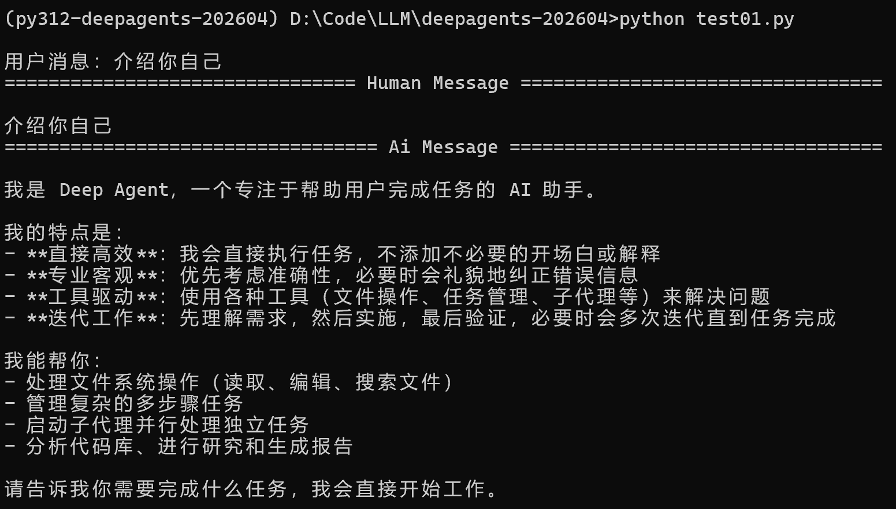

# DeepAgents

## 环境配置

### 资源准备

- **官方资源**

  - **官方文档：** [docs.langchain.com/oss/deepagents](https://www.google.com/search?q=https://docs.langchain.com/oss/deepagents) 
  - **GitHub 仓库：** [github.com/langchain-ai/deepagents](https://github.com/langchain-ai/deepagents) (内含大量的 `examples` 文件夹)
  - **NPM / PyPI：** 搜索 `deepagents` 查看最新的包版本和简易 README

- **环境管理**

  - **Anaconda**：https://www.anaconda.com/（左侧下载）

    > Conda 是一个**环境管理器**和**包管理器**。你在环境 A 里乱装东西弄坏了，只需要把这个环境删了就行，不会影响你电脑本身的系统或其他项目的运行。

  - **Miniconda**：https://www.anaconda.com/（右侧下载）

    > 轻量级 conda，它只包含 `conda`、`python` 和一些基础工具，下载和安装都非常迅速。说明文档： [Miniconda - Anaconda](https://www.anaconda.com/docs/getting-started/miniconda/main)

### 配置步骤

- **打开 conda**：运行程序 Anaconda Prompt 

- **同意条款**：首次创建环境前需要手动同意 Anaconda 的服务条款

  ```bash
  conda tos accept --override-channels --channel https://repo.anaconda.com/pkgs/main
  conda tos accept --override-channels --channel https://repo.anaconda.com/pkgs/r
  conda tos accept --override-channels --channel https://repo.anaconda.com/pkgs/msys2
  ```

- **创建环境并进入**

  ```bash
  conda create -n py312-deepagents-202604 python=3.12 -y # 创建环境
  conda env list # 查看所有环境列表
  conda activate py312-deepagents-202604 # 切换到环境
  ```

- **进入项目目录，安装依赖**

  ```bash
  cd /d PATH # 切换到D盘的工作目录
  pip list # 查看所有依赖
  pip install deepagents langchain-deepseek python-dotenv # 安装所需依赖
  pip list --format=freeze > requirements.txt # 导出依赖列表
  ```

  > 配置国内镜像源：如果 `pip install` 太慢，可以在命令行先换成清华源
  >
  > ```
  > pip config set global.index-url https://pypi.tuna.tsinghua.edu.cn/simple
  > ```

- **启动 IDE**：

  - **命令行启动**：如果你安装了 Cursor 的命令行工具，你可以输入 `cursor .`
  - **手动打开**：先打开 Cursor，然后点击 `File -> Open Folder` 选择你的项目目录
  - **选择环境【重要】**： 打开 Cursor 后，你必须告诉它使用你刚创建的 Conda 环境，否则代码会报错（找不到 `deepagents`）。
    - 快捷键：`Ctrl + Shift + P`
    - 输入：`Python: Select Interpreter`
    - 在列表中找到：`Python 3.12 ('py312-deepagents-202604': conda)`

## 使用模型

- **模型运行方式**

  - **远程模式（API）**

    - 当你运行 `agent.invoke` 时，你的电脑会通过网络把你的问题（比如“查天气”）打包发给 DeepSeek 的机房。计算位置在DeepSeek 昂贵的显卡（GPU）阵列上。你的电脑只负责**发送请求**和**接收文字**。

    - **DEEPSEEK_API_KEY**：https://platform.deepseek.com/

      > 如何选用模型：在代码中填写 `model` 参数时指定
      >
      > `deepseek-chat`：入门推荐，响应快，对应的是最新的 DeepSeek-V3.2，适合日常对话、总结、写代码。
      >
      > **`deepseek-reasoner`**：对应的是带“思维链”的模型（类似 OpenAI 的 o1），用于解决复杂数学题或逻辑陷阱。

  - **本地模式（Local LLM）**
    - 如果想在自己电脑上跑，需要使用 **Ollama** 这种工具下载模型文件（几 GB 到几十 GB），那时计算才会在你的 CPU/GPU 上运行。

### 远程模型

- **配置环境变量**：在项目根目录创建一个 `.env` 文件，放入你的 API Key

  ```
  DEEPSEEK_API_KEY=...
  OPENAI_API_KEY=...
  ```

  > sk-309722f8dd5d4c3cb78a91bd5c01af53

- **使用示例**：初始化一个具备深度思考能力的 Agent，并实现一个简单的交互式命令行对话

  ```py
  from deepagents import create_deep_agent # 用于创建Agent
  from dotenv import load_dotenv # 用于加载环境变量
  load_dotenv() # 加载环境变量(API KEY)
  
  # 创建一个Agent, 指定模型
  agent = create_deep_agent(
      model="deepseek:deepseek-chat" 
  )
  
  # 运行Agent
  while(True):
      input_text =input("\n用户消息：")
      if input_text.lower() in ["exit","quit"]:
          print("Exiting...")
          break
      # 调用Agent的invoke方法, 把输入发送给LLM, 并获取返回结果
      results = agent.invoke(
          {"messages": [{"role": "user", "content": input_text}]}
      )    
      # 遍历模型返回的所有消息
      # results["messages"] 是一个列表，里面包含对话内容（用户 + AI）
      for message in results["messages"]:
          message.pretty_print() # 格式化打印消息
  ```

- **运行程序**：在 Anaconda Prompt 窗口 `python 脚本.py`

  > 

- `agent.invoke()` 返回的是什么：

  一个字典（dict），里面包含完整的对话结果，`print(results)` 可以看到其结构。

  > ```
  > results = {
  >     "messages": [
  >         HumanMessage(...),      # 用户消息
  >         AIMessage(...)        	# AI 回复
  >     ]
  > }
  > ```
  >
  > `results` 是一个 **字典**（键值对 ≈  `Map<String, List<Message>>`），其中 `:` 用于分隔一对键值对中的键和值，若有多个键值对则用 `,` 分隔。
  >
  > `"messages"` 是键（字符串）
  >
  > `[...]` 是值，这个值是一个 **列表**（List ≈ `ArrayList`）
  >
  > 这个列表里有两个元素，一个是 `HumanMessage` 对象，一个是 `AIMessage` 对象

### 本地 Ollama 

- **前置条件**：

  - 安装 Ollama

  - 下载大模型

    > ```bash
    > # 查看有哪些模型
    > (py312-deepagents-202604) D:PATH> ollama alist
    > ```

  - 安装依赖：`pip install langchain-ollama`

- **代码示例**：在远程代码的基础上，只需要更改使用的模型这一行即可

  ```py
  # 创建一个Agent, 指定模型
  agent = create_deep_agent(
      model="ollama:qwen3:8b" 
  )
  ```


## 创建 Agent

### 创建函数 `create_deep_agent` 

```py
create_deep_agent(
    name=None,              # agent名字 (可选)
    model=None,             # 模型名 (可选, 默认claude-sonnet-4-6)
    tools=None,             # 工具列表 (可选)
    system_prompt=None,     # 系统提示 (可选)
    middleware=None,		# 中间件 (可选)
    subagents=None,			# 子代理 (可选)
    backend=None			# 后端 (可选, 默认StateBackend)
) -> CompiledStateGraph    	# 返回一个 Agent 对象
```

### 模型 `model` 

```py
agent = create_deep_agent(
    model=init_chat_model(
        model="claude-sonnet-4-6",
        max_retries=10,  # 重试失败的 API 请求 (default: 6)
        timeout=120,     # Increase timeout for slow connections
    ),
)
```

> 使用 openai 模型需要先：`pip install langchain-openai`

### 工具 `tools` 

> https://github.com/langchain-ai/deepagents/tree/main/examples

- **==自定义工具函数==**：`from langchain_core.tools import tool` + `@tool`

  ```py
  from deepagents import create_deep_agent
  from langchain_core.tools import tool #用于把一个普通函数“注册”为工具（给 agent用）
  
  # 1. 定义工具函数
  @tool  # 使用 @tool 装饰器，把这个函数注册为一个工具
  def get_weather(city: str) -> str:
      """Get weather for a given city."""
      return f"It's always sunny in {city}!"
  
  # 2. 配置和创建agent
  agent = create_deep_agent(
      model="openai:gpt-5.4", 						# 指定模型
      tools=[get_weather],							# 绑定工具
      system_prompt="You are a helpful assistant", 	# 系统prompt
  )
  
  # 3. 运行agent
  agent.invoke(
      {"messages": [{"role": "user", "content": "what is the weather in sf"}]}
  )
  ```

  > 示例 2 见：LLM\deepagents-202604\03-tools.py

### 系统提示 `system_prompt` 

> Deep Agents 自带一个系统提示。默认系统提示包含使用内置规划工具、文件系统工具和子代理的详细说明。当中间件添加特殊工具，比如文件系统工具时，会将其附加到系统提示符中。

```py
research_instructions = """\
You are an expert researcher. Your job is to conduct \
thorough research, and then write a polished report. \
"""

agent = create_deep_agent(
    system_prompt=research_instructions,
)
```

### 中间件 `middleware` 

- **工具和中间件的区别**

  - 工具 = 让模型 “做事情” 的能力

  - 中间件 = 控制 / 增强工具调用过程；管流程（不做事，只管怎么做）

    常用于：打印日志、权限控制、限流、参数过滤、安全审计

    > 下例中 `log_tool_calls` 函数的作用是：拦截工具调用，在调用前/后插入打印日志的逻辑，不改变工具本身。

#### wrap_tool_call 型中间件

- `from langchain.agents.middleware import wrap_tool_call` 是专门用于 “拦截 tool 调用” 的中间件注册器。

  执行流程：`Agent → middleware → tool → middleware → Agent`

  > 还有用于拦截 agent 输入输出、拦截 LLM 请求等的不同类型中间件，需要导入不同包，使用不同装饰器注册。

- **参数 `request` 和 `handler`**：是框架定义的固定协议，就像是插头和插座的关系。

  - `@wrap_tool_call` 这个装饰器在后台工作时，它期望接收到的函数必须满足双参数签名：第一个参数接收当前的请求上下文。第二个参数接收执行逻辑的下一步函数。

  - **`request` (快递单)**：一个对象，包含了 AI 想要干什么的所有信息。

    它里面有：`request.name`（工具的名字，比如 "get_weather"）和 `request.args`（参数，比如 `{"city": "Shanghai"}`）。

  - **`handler` (快递员)**：一个可执行的函数。

    它的作用是把“快递”送往下一站。如果你不调用 `handler(request)`，这个工具调用就会被“拦截”在中间件里，永远不会执行。

- **调用流程**：你永远不需要手动调用 `log_tool_calls`。 实际的传参是由 Agent 内部的执行引擎自动完成的。

  1. **AI 发出指令**：模型说“我想调用 `get_weather`，参数是 `Shanghai`”。
  2. **框架封装 Request**：框架生成一个对象：`ToolRequest(name="get_weather", args={"city": "Shanghai"})`。
  3. **框架触发中间件**：
     - 框架自动把这个对象传给 `request`。
     - 框架把真正的工具函数（即 `get_weather`）包装成一个函数，传给 `handler`。
  4. **执行工具函数**：执行 `result = handler(request)` 时，程序才真正进入到工具函数 `@tool get_weather` 里。

```py
from langchain.tools import tool # 用于注册工具函数
from langchain.agents.middleware import wrap_tool_call # 用于定义拦截tool调用型的“中间件”
from deepagents import create_deep_agent # # 用于创建一个agent

# 1. 定义工具函数
@tool
def get_weather(city: str) -> str:
    """Get the weather in a city."""
    return f"The weather in {city} is sunny."

# 创建一个列表，用来记录调用次数
call_count = [0]  

# 2. 定义一个中间件, 使用@wrap_tool_call注册, 这个函数会在“每次工具调用前后”被执行
# request：工具调用请求（包含工具名、参数等）
# handler：真正执行工具的函数（必须调用它）
@wrap_tool_call
def log_tool_calls(request, handler):
    """Intercept and log every tool call - demonstrates cross-cutting concern."""
    call_count[0] += 1 # 每次调用工具时，计数 +1
    # 获取工具名称（如果有 name 属性）
    tool_name = request.name if hasattr(request, 'name') else str(request)
	# 打印日志：第几次调用 + 工具名称
    print(f"[Middleware] Tool call #{call_count[0]}: {tool_name}")
    # 打印工具参数（如果有 args 属性）
    print(f"[Middleware] Arguments: {request.args if hasattr(request, 'args') else 'N/A'}")
    # 调用 handler 才会真正执行工具，即调用 get_weather
    result = handler(request)
    # 打印调用完成日志
    print(f"[Middleware] Tool call #{call_count[0]} completed")
	# 返回工具执行结果（必须返回）
    return result

# 3. 创建一个 agent
agent = create_deep_agent(
    tools=[get_weather], # 注册工具（模型可以调用这些函数）
    middleware=[log_tool_calls], # 注册中间件（会包裹工具调用过程）
)
```

#### 中间件设计原则

**把中间件当成“无状态”的函数**

- 成员变量 `self.x` 只用来放那些<u>永远不会变</u>的配置（比如 API Key 或超时时间）

  > 在普通的 Python 编程中，我们习惯用 `self.x = 1` 来记录某个数值。但在这种 AI 代理（Agent）框架中，中间件（Middleware）通常是**单例**或**共享**的。
  >
  > **错误做法：** 你在 `__init__` 里定义了 `self.x`，然后在 `before_agent` 里修改它。
  >
  > **后果：** 想象一下，如果有 10 个用户同时在调用这个 AI，或者 AI 正在并行运行 5个工具。这所有的线程都会**同时**去修改同一个 `self.x`。
  >
  > **竞态条件（Race Condition）：** 线程 A刚读取 `x=1` 准备加 1，线程 B 已经把 `x` 改成了 2。结果线程 A 写回时还是 2，而不是预期的 3。这就会导致计数不准或程序崩溃。

- **使用 ==“图状态”（Graph State）==**：任何需要<u>累加、计数、记录</u>的数据，全部通过 `state.get()` 读取并随 `return` 更新。

  - **Graph**：LangGraph 定义的 AI 任务的流程图

    - **节点（Nodes）：** 是具体的动作（比如调用模型、搜索网页）

    - **边（Edges）：** 是动作之间的连线

    - **图状态（Graph State）：** 在这张图里流动的“快递盒”

      每当流程走到一个节点时，框架会把这个“快递盒”交给你。你可以查看盒子里有什么，也可以往里加东西，然后传给下一个节点。

  - **Graph State**：线程安全的全局上下文，图状态和 `self.x` 的本质差异在于它的作用域（Scope）。

    - **数据结构**：一个 Python 字典 (TypedDict) 或 Pydantic 模型
    - **生命周期：** 随着 “一次对话请求” 的产生而产生，随着请求结束而销毁
    - **并发设计：** DeepAgent 会确保每个独立的用户请求都有一个完全隔离的字典副本。即使 100 个人同时提问，框架也会准备 100 个“快递盒”，互不干扰

- **使用示例**：使用图状态分为三个步骤：定义、读写、合并。

  - 定义 Schema（告诉框架盒子里装什么）

    ```py
    from typing import TypedDict
    
    class MyGraphState(TypedDict):
        counter: int
        user_input: str
        history: list
    ```

  - 在中间件或节点中读写：当编写 `before_agent` 时，框架会自动把当前的 `state` 传给你。

    ```py
    def before_agent(self, state: MyGraphState, runtime):
        # 1. 读取（Read）
        current_count = state.get("counter", 0)
        
        # 2. 返回更新（Update）
        # 注意：不要原地修改 state['counter'] = x
        # 而是返回一个包含更新内容的字典，框架会自动帮你“合并”
        return {"counter": current_count + 1}
    ```

  - 自动合并（Reducer）：大多数框架支持 **Reducer** 模式：

    - 如果返回的是 `{"counter": 2}`，它会**覆盖**旧的值。
    - 如果你定义了特定的合并方式（比如列表），返回 `{"history": ["新消息"]}` 时，它会自动**追加**到旧列表后面，而不是替换掉。

### 子代理 `subagents`

隔离详细工作、避免上下文膨胀

```py
import os
from typing import Literal
from tavily import TavilyClient
from deepagents import create_deep_agent
# 创建 Tavily 客户端
tavily_client = TavilyClient(api_key=os.environ["TAVILY_API_KEY"])

# 1. 定义一个工具函数
def internet_search(
    query: str,  # 搜索关键词
    max_results: int = 5,  # 返回结果数量
    topic: Literal["general", "news", "finance"] = "general",  # 搜索类型
    include_raw_content: bool = False,  # 是否返回原始网页内容
):
    """Run a web search"""
    return tavily_client.search( 
        query,
        max_results=max_results,
        include_raw_content=include_raw_content,
        topic=topic,
    )

# 2. 定义一个“子智能体”（sub-agent），本质是一个配置字典
research_subagent = {
    "name": "research-agent", # 子agent的名字（内部标识）
    # 子agent的描述（主 agent 会根据这个决定是否调用它）
    "description": "Used to research more in depth questions",
    # 子agent的系统提示词（角色设定）
    "system_prompt": "You are a great researcher",
    # 子agent可用的工具
    "tools": [internet_search],
    # 指定这个子agent使用的模型（可选），不写则默认使用主agent的模型
    "model": "openai:gpt-5.2",
}

# 把子agent放进列表（因为可以有多个subagent）
subagents = [research_subagent]

# 3. 创建主agent, 传入子代理列表
agent = create_deep_agent(
    model="claude-sonnet-4-6",  # 主agent使用的模型
    subagents=subagents  		# 注册子agent（主agent可以“调用子agent”）
)
```

### 后端 `Backends`

- **分类**：根据业务需求选择

  | **后端名称**          | **物理位置**                               | **存储时长**                             | **访问限制**                  |
  | --------------------- | ------------------------------------------ | ---------------------------------------- | ----------------------------- |
  | **StateBackend**      | **内存**（存在 LangGraph 的 state 字典里） | **临时**。对话结束或程序重启，数据就没了 | 仅限当前这一个对话线程        |
  | **FilesystemBackend** | **硬盘**（文件夹）                         | **永久**                                 | 所有线程                      |
  | **LocalShellBackend** | **操作系统环境**                           | 取决于你的系统设置                       | AI 可以直接通过命令行操作文件 |
  | **StoreBackend**      | **数据库**                                 | **长久**。专门用于跨天、跨月的记忆       | 跨线程、跨用户共享            |
  | **CompositeBackend**  | 复合                                       | 复合                                     | 复合                          |

- **CompositeBackend（复合后端）**：允许你把多个后端叠在一起。

  在创建代理（Agent）时，`backend` 参数通常只能接收一个对象。如果你需要同时拥有多种后端的特性，就必须使用 `CompositeBackend`（复合后端）。

  > 例如把 “技能文件夹” 设为只读的 `FilesystemBackend`
  >
  > 把 “运行时产生的数据” 设为 `StateBackend`
  >
  > 这样，AI 既能从硬盘读取本领，又不会把运行过程中的草稿纸（临时文件）乱丢到你的硬盘上。

#### StateBackend

**短线、简单、安全**

> 处理用户的临时上传，例如用户传了一个 PDF 让 AI 总结，总结完就不用管了。

```py
from deepagents.backends import StateBackend

agent = create_deep_agent(
    backend=StateBackend() # 默认就是这个, 可省略
)
```

#### FilesystemBackend

**留档、给 AI 喂固定技能**

> 构建 AI 的知识库或技能库，你写好了一些 Python 脚本（技能），希望 AI 每次启动都能学会这些本领。你需要把这些技能文件存在硬盘的一个目录下，启动 Agent 时指向这个目录。

```py
from deepagents.backends import FilesystemBackend

agent = create_deep_agent(
    backend=FilesystemBackend(root_dir=".", virtual_mode=True)
)
```

> `root_dir` 定义 AI 可读取文件系统的根目录，`"."` 指向当前程序运行目录
>
> `virtual_mode=True`：是否开启 “虚拟文件系统”，推荐 `True` （不会真的改电脑文件）

#### LocalShellBackend

**让 AI 直接操作你的电脑（高风险）**

> AI 自动写代码生成一个 `.py` 文件并执行它

```py
from deepagents.backends import LocalShellBackend

agent = create_deep_agent(
    backend=LocalShellBackend(root_dir=".", env={"PATH": "/usr/bin:/bin"})
)
```

> `env={"PATH": "/usr/bin:/bin"}`：环境变量，系统去哪里找命令

#### StoreBackend

长期记忆、把信息持久化到数据库

> 用户昨天说他的内容，今天 AI 还要记得。

```py
from langgraph.store.memory import InMemoryStore
from deepagents.backends import StoreBackend

agent = create_deep_agent(
    backend=StoreBackend(
        namespace=lambda ctx: (ctx.runtime.context.user_id,),
    ),
    store=InMemoryStore() 
)
```

#### CompositeBackend

复合后端

```py
from deepagents import create_deep_agent
from deepagents.backends import CompositeBackend, StateBackend, StoreBackend
from langgraph.store.memory import InMemoryStore

agent = create_deep_agent(
    backend=CompositeBackend(
        default=StateBackend(),
        routes={
            "/memories/": StoreBackend(),
        }
    ),
    store=InMemoryStore()  # Store passed to create_deep_agent, not backend
)
```


## 示例

- **天气 + 新闻 智能体**

  - **环境**： `pip install deepagents langchain_openai`

  - **示例**

    ```py
    from deepagents import create_deep_agent
    from langchain_core.tools import tool #用于把一个普通函数“注册”为工具（给 agent用）
    
    # 1. 定义天气工具
    @tool # 使用 @tool 装饰器，把这个函数注册为一个工具
    def get_weather(city: str) -> str:
        """获取指定城市的实时天气。"""
        # 实际开发中这里会接入 OpenWeather API
        return f"{city}今天晴转多云，25°C。"
    
    # 2. 定义新闻工具
    @tool
    def search_news(topic: str) -> str:
        """搜索关于某个话题的最新新闻。"""
        # 实际开发中这里会接入 Tavily 或 DuckDuckGo
        return f"关于 {topic} 的最新头条：AI Agent 框架 DeepAgents 正式发布！"
    
    # 3. 创建 Deep Agent (核心区别在于这个方法)
    # 它会自动为你构建 Planning（规划）和 Reflection（反思）节点
    agent = create_deep_agent(
        model="openai:gpt-4o",  # 或 "claude-3-5-sonnet"
        tools=[get_weather, search_news],
        system_prompt="你是一个高效的个人助理，负责通过工具获取信息并总结。"
    )
    
    # 4. 运行并查看逻辑
    response = agent.invoke({
        "messages": [{"role": "user", "content": "帮我查一下上海的天气，并搜一下今天关于 DeepAgents 的新闻。"}]
    })
    
    print(response["messages"][-1].content)
    ```

  - 这个 Agent 到底是怎么 run 起来的？——**DeepAgents 的“执行图 (Execution Graph)”**。

    与普通 LangChain Agent 不同，DeepAgents 的内部是一个由 **LangGraph** 驱动的状态机。你可以尝试在代码里加上这一行来观察它的结构：

    ```py
    # 打印执行图的节点，看看它比起普通 Agent 多了哪些步骤
    print(agent.get_graph().nodes.keys())
    ```

    你会发现它不仅仅有 `call_model` 和 `call_tools`，通常还包含：

    1. **Planning (规划层)**：它接收到用户指令后，会先生成一个“任务清单”（Todo List），决定先查天气还是先搜新闻。
    2. **State Management (状态层)**：它会把天气结果存入“短期记忆”，供搜索新闻时参考（例如：如果天气不好，它可能会在搜新闻时自动增加“暴雨预警”的搜索项）。
    3. **Reflection (反思层)**：在给用户最终答案前，它会自我检查：“我查到的天气和新闻完整吗？有没有遗漏？”

  -  建议你在跑通代码后，重点研究以下三点：
    1. **观察日志 (Tracing)**：使用 **LangSmith**（LangChain 的可视化工具）观察。你会看到 DeepAgents 在后台会进行多次 LLM 调用，甚至会有自己跟自己对话（规划步骤）的过程。
    2. **研究“中介软件 (Middleware)”**：DeepAgents 的一大特色是支持 Middleware。你可以尝试写一个简单的 Middleware，在工具被调用前打印一条 Log，这样你就理解了它在执行流程中是如何拦截信息的。
    3. **对比实验**：你可以尝试用普通的 `create_react_agent` (LangChain 原生) 和 `create_deep_agent` 处理同一个复杂问题。你会发现 DeepAgents 在处理“先做什么、后做什么”的逻辑上要聪明得多。


