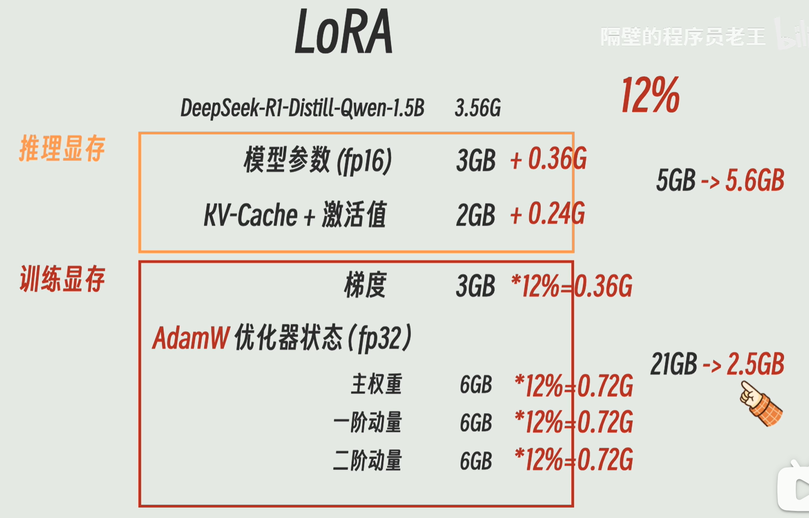

# LLM（Large Language Model）


## LLM 的训练

### 1. 预训练（Pre-training）

- **目标：** <u>语言建模</u>，让模型学会语言的规律、常识和逻辑。这是最费钱、最耗时的阶段。模型会阅读互联网上几乎所有的文本（维基百科、书籍、代码、论文）。

  > 建立“太棒了”与“积极/正面/好”这些词之间的强烈关联（Embedding 空间离得很近）。

- **训练方式：** 预测下词。给它一句话，遮住最后一个字让它猜。猜错了就调整模型参数。

- **结果：** 得到一个 **Base Model**，它不会回答问题，只会补全文本。


### 2. 微调（SFT - Supervised Finetuning）

- **目标：** 也叫指令微调，用于<u>规范行为</u>，让模型学会听指令。当人问它翻译时，要给翻译；当人问它写诗时，要写诗。
- **训练方式：** 人工编写几万组高质量的 QA 对，让模型学习回复格式和人类的表达逻辑。
- **结果**：得到 **SFT Model**，能够对话

#### 全参数微调（Full FT）

改造所有神经元

- 对于 3.56G 的 DeepSeek-R1-Distill-Qwen-1.5B 模型: 
  - **推理显存**：5GB
    - **模型静态占用**：1.5B 模型 = 15 亿个参数。 如果用 fp16 (Float 16) 存储：15亿 * 2字节 = 3GB
    - **临时负载**：2GB
      - **KV-Cache（记忆缓存）**：模型每生成一个字，都要回顾之前的字。为了不重复计算，它把之前字的特征存起来，就叫 KV-Cache
      - **中间激活值（Activations）**： 计算过程中产生的临时结果
  - **训练显存**：21GB
    - **梯度（Gradient）**：3GB。为了计算 Loss 怎么下降，需要知道每个参数该往哪个方向改。每一个参数都要对应产生一个梯度。既然有 15 亿个参数，就要存 15 亿个梯度。用 fp16 存，又是 3GB。
    - **优化器状态（Optimizer States）**：18GB 
      - **主权重 (Master Weights)：** 备份一份 fp32 的模型参数，防止精度丢失（15亿*4 = 6GB）
      - **一阶动量 (Momentum)：** 记录参数更新的方向（15亿*4 = 6GB）
      - **二阶动量 (Variance)：** 记录更新的剧烈程度（15亿*4 = 6GB）

#### 参数高效微调（PEFT）

Parameter-Efficient Fine-Tuning，比如 LoRA、QLoRA，<u>只改造一小部分参数</u>，解决显存不够的问题（因为训练显存和调整参数数量成正比）。

- **==LoRA==（低秩自适应，Low-Rank Adaptation）**

  - 假设模型里有一个原矩阵 $W$（大小是 $a \times b$）。

    - **全量微调：** 直接去修改 $W$ 里的每一个数字，要改 $a \times b$ 个参数。

    - **LoRA：** 冻结 $W$ 的全部参数（Freeze）。在它旁边搞建一个支路（Bypass），这个支路是由两个瘦长的矩阵 **$A$** 和 **$B$** 相乘构成的。

      - **矩阵 A：** 大小是 $a \times r$（非常瘦）

      - **矩阵 B：** 大小是 $r \times b$（非常扁）

      - **相乘：** $A \times B$ 得到的结果，矩阵形状正好又是 $a \times b$

  - **r** = **Rank（秩）**。它是人为设定的一个数字，通常非常小（比如 8 或 16）。

    > 为什么参数量会变小？假设原矩阵 $a=1000, b=1000$：
    >
    > **原参数个数：** 1000 \*1000 = 1,000,000（100万个）
    >
    > **LoRA 参数个数 (r=8)：**矩阵 $A$（1000 \* 8 = 8,000） + 矩阵 $B$（8 \* 1000 = 8,000）= 16,000（1.6万个）
    >
    > 在这个例子中，只需要训练 **1.6%** 的参数，就能达到接近全量训练的效果。

  - **计算**：

    - 模型推理时候的公式：$$\text{最终输出} = (\text{旧矩阵 } W + \text{新矩阵 } A \times B) \times \text{输入数据}$$

    - 训练完后，把 $A \times B$ 的结果加回原矩阵（*alpha/r），模型就学会了新技能。

  - **显存占用**

    > 

### 3. 人类反馈强化学习（RLHF）

- **目标：**价值观对齐，也叫对齐微调（Alignment Tuning）。调整模型，使其更<u>符合人类的偏好和道德标准</u>。但这也会一定程度减弱模型的泛化程度，一般称这种现象为 alignment tax。

- **奖励建模（Reward Modeling）**：让模型针对同一个问题给出几个不同的答案，由人类来打分（哪个好，哪个坏）。得到 **RM Model**，学习打分（一个奖励函数）。

- **强化学习（Reinforcement Learning）**：给出大量提示词，SFT 生成回答，RM 打分。得到 RL Model。


## 优化理论（Optimization）

数据 → 模型 → <u>预测 → 计算误差 → 更新参数</u> → 循环

1. **输入特征给模型：**特征 = 文本经过 Token化 和 Embedding 后转化成的向量

2. **==前向传播（Forward）==**：模型根据现有的权重（“旋钮位置”）猜测出一个结果

   > 数据（比如一张猫的照片）经过每一层神经元的计算（乘法和加法），最后输出一个结果。模型说： “我觉得这张图 80% 是狗。”
   >

   - **权重 (Weight / Parameters)**：模型内部成千上万个数字，代表了不同特征的**重要程度**。深度学习的目标就是找到一组最完美的 “旋钮位置”。

     在 Transformer 中，Q、K、V 矩阵本质上全是权重

     > 可以理解为 “调音旋钮”。想象模型面前有一排旋钮。
     >
     > 识别苹果时，“颜色”这个特征的权重旋钮可能拧得很大（很重要）；“价格”这个特征的权重旋钮可能拧得很小（因为贵不贵不影响它是不是苹果）。
     >

3. **==计算损失（Loss Calculation）==**：发现结果不对，将模型猜的结果和真实答案对比，**损失函数**算出误差多少。

   - **损失函数 (Loss Function)** ：预测得越准，损失（Loss）越小，越接近 0。

     对于 LLM，几乎统一使用 **交叉熵损失**（Cross-Entropy Loss），模型对正确答案给出的概率越低，惩罚（Loss）就呈指数级增长。

4. **==反向传播（Backward）==**：纠错，**优化器**根据损失，反向把模型的**权重**旋钮微调一下。

   > 顺着层级往回走，告诉每一层神经元：“你刚才猜错了，把你的参数调一下，下次往‘猫’的方向靠拢。”

   - **优化器 (Optimizer)**：“改进方案”，根据损失函数给出的反馈，决定**如何调整权重**的算法。优化器会算出一个“梯度”（方向），然后让权重往误差减小的方向挪一小步。
     - **常见的优化器：** Adam。
   - **数学工具：** **梯度下降 (Gradient Descent)**。就像下山一样，寻找误差最小的那个点。

5. **循环往复：** 重复几百万次，直到损失函数几乎为 0。

#### 损失函数

- **绝对值损失（L1 Loss / MAE）**：$L = |y_{预测} - y_{真实}|$

  - **特点**：稳健（Robust），不会受到个别极端错误（异常值）的过度干扰
  - **缺点**：在零点处不可导，且在误差很小时下降速度依然一样，不够精细
  - **作用**：回归/预测数值（比如预测明天的气温）

- **平方损失（L2 Loss / MSE）**：$L = (y_{预测} - y_{真实})^2$

  - **特点**：厌恶异常值。因为平方的存在，误差越大，惩罚会呈指数级增长

  - **缺点**：模型容易被几个坏数据（噪声）带偏，因为它为了讨好那几个异常点会牺牲全局精度
  - **作用**：回归/预测数值（比如预测明天的气温）

- **Huber Loss**：介于绝对值和平方之间，误差小时用平方，误差大时用绝对值。

  - **特点**：在误差较小时，它像 MSE 一样平滑，方便模型精细调整；当误差很大时（遇到异常值），它转为 L1 模式，防止模型被带跑偏。常用于回归任务。
  - **作用**：回归/预测数值（比如预测明天的气温）

- **KL Divergence（KL 散度）**：$D_{KL}(P || Q) = \sum P(x) \log \frac{P(x)}{Q(x)}$

  - **作用**：衡量两个**概率分布**之间的差异。用于模型对齐/防止跑偏，比如防止 AI 变得太毒舌或太复读机。
  - **物理意义：** 在 LLM 领域，它常用于 **RLHF（强化学习）** 阶段。我们会计算“新训练的模型”和“原始模型”之间的 KL 散度，目的是为了防止新模型在学习人类偏好时“跑得太远”，导致原本的知识崩塌（模型坍塌）
  - 它具有不对称性（P 对 Q 的散度不等于 Q 对 P）

- **==交叉熵函数==（Cross-Entropy Loss）**：$$Loss = -\sum_{i=1}^{n} y_{i} \log(p_{i})$$

  > **$n$**：候选池里所有词的数量（词表大小）
  >
  > **$y_{i}$**：真实标签。正确答案那个词的 $y$ 是 1，其他所有错误的词 $y$ 都是 0
  >
  > **$p_{i}$**：模型预测的概率。模型认为第 $i$ 个词出现的可能性（比如 0.1, 0.7 等）

  - **作用**：用于<u>处理分类任务</u>（包括文本生成，即从几万个词里选一个）。几乎所有的大语言模型（DeepSeek, GPT 等）在预训练阶段都只用这个损失函数。
  - **物理意义：**模型对正确答案的 “惊讶程度”
    - 如果正确答案是“光”，模型预测“光”的概率是 0.99，Loss 接近 0（不惊讶）；
    - 如果预测“光”的概率只有 0.01，$-\log(0.01)$ 会变得非常大，产生巨大的 Loss（非常惊讶，说明学得不好）。
    - **最大化似然：** 最小化交叉熵，本质上就是逼迫模型把所有的“概率能量”都集中到那个正确的词上。

  > 假设词表里只有三个词：`["大", "家", "好"]`。当前的正确答案是：`“家”`。
  >
  > 1. 准备真实分布 ($y$)：$y = [0, 1, 0]$（代表“大”是 0，“家”是 1，“好”是 0）
  >
  > 2. 模型给出预测 ($p$)：$p = [0.1, 0.7, 0.2]$（它认为 70% 的概率是“家”）
  >
  > 3. 套入公式：$$Loss = -(0 \times \log(0.1) + 1 \times \log(0.7) + 0 \times \log(0.2))$$
  >
  >    只有正确答案的 $y$ 是 1，其他项乘完 0 都消失了！所以公式简化为：
  >
  >    $$Loss = -\log(0.7) \approx 0.35$$
  >
  > 观察 $\log$ 函数的特性：
  >
  > - 如果模型预测正确答案的概率 $p=1$（100%）：$-\log(1) = 0$。模型完全猜对了，**Loss 为 0**，不需要接受惩罚
  > - 如果模型预测正确答案的概率 $p=0.1$（很低）：$-\log(0.1) \approx 2.3$。**Loss 变大**，优化器会让模型调整参数
  > - 如果模型预测正确答案的概率 $p=0$：$-\log(0) \to \infty$。**Loss 爆炸**，说明模型完全学反了


## 评测（Harness）

- **训练流程：** 数据准备 $\rightarrow$ 预训练 $\rightarrow$ **[评测]** $\rightarrow$ SFT 微调 (LoRA) $\rightarrow$ **[评测]** $\rightarrow$ RLHF 对齐 $\rightarrow$ **[终极评测]** $\rightarrow$ 部署。

- **评测的本质：** 它是**客观的质量把控**。没有评测，模型训练就像是在黑箱里开车，你不知道是开向了终点，还是开下了悬崖。

- **评测方式分类**

  > 如果你是在微调（LoRA）一个模型，**lm-eval** 是第一选择；
  >
  > 如果你发现模型在 lm-eval 跑分很高但说话很僵硬，可能需要引入 **OpenCompass** 或 **GPT-4 打分** 来进一步诊断。

  - **静态考卷派（Static Benchmarks）**：通过固定的题库来跑分。

    > **LM Evaluation Harness**（lm-eval）、HELM（Stanford）、OpenCompass（司南）。

  - **模拟面试派（Model-as-a-Judge）**：有些问题没有标准答案（比如：“写一首赞美西瓜的诗”），lm-eval 就没法判分了。这时候，我们请一个更强的模型（比如 GPT-4o）来当老师。

    方式：将你的模型的回答和标准参考回答一起喂给 GPT-4，让它打分（1-10分）或者对比哪个更好。

    > AlpacaEval, MT-Bench

  - **竞技场派 (Human Side-by-Side / Arena)**：采用类似《英雄联盟》或围棋的 **Elo 等分系统**。网页上同时出现模型 A 和模型 B，不告诉你名字。用户提问，两个模型同时作答。用户选出觉得更好的那个，系统据此计算胜率和排名。

    > LMSYS Chatbot Arena

### LM Evaluation Harness（`lm-eval`）

开源的大模型标准化评测工具包（[EleutherAI/lm-evaluation-harness](https://github.com/EleutherAI/lm-evaluation-harness)）

自动在 MMLU、GSM8K 等数千个任务上跑分，验证模型真实能力。 基于模型输出正确答案的概率（Likelihood）进行自动化判卷。

- **==三个核心功能==**

  - **题库（Task Collection）**：集成了几百个经典的 AI 考卷，涵盖了不同的能力维度

    > **常识推理：** 比如 HellaSwag（考模型是否理解生活常识）
    >
    > **数学能力：** 比如 GSM8K（小学数学应用题）
    >
    > **综合知识：** 比如 MMLU（涵盖 57 个学科，包括法律、医学、物理等）
    >
    > **逻辑翻译：** 各种语言之间的翻译测试

  - **统一的考试方式（Unified Interface）**

    不同的模型（GPT, LLaMA, DeepSeek）输出格式不一样，有的喜欢啰嗦，有的喜欢简短。 Harness Engine 规定了统一的“判卷标准”。例如，它会强制模型回答选择题（A/B/C/D），然后通过计算模型对不同选项输出的 可能性（Likelihood） 来判断模型选了哪个。

  - **Few-shot（零样本/少量样本）测试**

    它支持测试模型在没有任何提示（0-shot）或者只有几个例子（Few-shot）的情况下，处理新任务的能力。

- **==作用==**

  - **防止“刷题”作弊：** 它提供了标准的验证集，防止开发者在训练时把测试题喂给模型。

  - **横向对比：** 它是目前开源界最公认的基准。

    > 如果你看到一个模型说它“超越了 GPT-4”，通常它展示的就是在 Harness Engine 上的跑分。

  - **监控训练效果：** 比如你在做 **LoRA 微调**。你可以在微调前后都跑一次 Harness。如果微调后逻辑能力（MMLU 评分）大幅下降，说明你可能遇到了**“灾难性遗忘”**。

- **==跑分底层逻辑==**

  - **概率选择法**（Multiple Choice / Loglikelihood）：最主流的跑法（如 MMLU 考试）
    1. **输入：** “中国的首都是：A.上海 B.北京”。
    2. **模型计算：** 模型不会直接说话，而是去计算它输出“A”的**概率**是多少，输出“B”的**概率**是多少。因此不受到模型说话风格影响。
    3. **判定：** 比较两个选项的 **Loss（交叉熵）** 或者 **Log-likelihood（对数似然）**。哪个选项的概率最高（Loss 最低），就认为模型选了哪个。
  - **生成匹配法**（Generation / Exact Match）：用于数学题（如 GSM8K）或代码题。
    1. **输入：** “1+1等于几？最后请给出数字。”
    2. **模型计算：** 让模型自由生成一段话，比如“计算得出结果是2”。
    3. **判定：** 使用**正则表达式**从模型的话里把“2”提取出来，跟标准答案对比。如果完全一致，得 1 分。

- **==使用示例==**

  ```bash
  # 安装环境
  git clone https://github.com/EleutherAI/lm-evaluation-harness
  cd lm-evaluation-harness
  pip install -e .
  # 运行评测命令, 测试模型在 GSM8K（数学）和 HellaSwag（常识）上的表现
  lm_eval --model hf \
      --model_args pretrained=模型路径,peft=你的LoRA路径 \
      --tasks gsm8k,hellaswag \
      --device cuda:0 \
      --batch_size 8
  ```

  > **`--model hf`**：使用 Hugging Face 的模型加载器
  >
  > **`--tasks`**：要考哪几门课
  >
  > **`--device cuda:0`**：使用第一块显卡


## RAG（检索增强生成）

Retrieval-Augmented Generation

- **==意义==**：不重新训练模型，让模型学会**“翻书”**，通过搜索外部文档（如 PDF、数据库）来回答它原本不知道的问题。

  - **知识时效性：** 模型的知识停留在它训练完的那一天

  - **幻觉 (Hallucination)：** 面对不知道的问题，模型会根据概率编造一个听起来很合理的假答案。因为生成模型本质上是在根据概率**“预测下一个字”**。它并不真正连接现实数据库，它只是觉得这个字接在后面“听起来很顺”。

  - **私有数据安全：** 你不可能为了让 GPT 知道你们公司的内部文档，就把这些机密数据喂给 OpenAI 去重新训练模型。


- **==工作流程==**

  1. **准备数据**（Indexing / 索引）：提供文档 → 文本分割 → 向量化 → 数据入库

     > 用户提供公司政策 PDF 文档

     - **分块（Chunking）**：把文档分块，拆成一小段一小段的 Text Chunks（比如每 500 字一段）。目的是把语义相近的 Token 聚集在一起，因为长文本中各个片段的语义可能存在较大差异。
     - **向量化（Embedding）**：调用模型（如 OpenAI 或 BGE）把这些 Chunks 文本变成向量
     - **存入向量数据库（Vector Database）** ：如 Chroma, Pinecone

  2. **用户提问**（Query）

     > 用户问：“我们公司 2026 年的年终奖政策是什么？”

  3. **数据检索**（Retrieval）

     - 把用户的问题也变成向量（Embedding）。

     - 在向量数据库里 “找邻居”：寻找哪些段落的向量和问题的向量最接近。

       > 找到了第 42 页和第 108 页关于年终奖的规定。


  4. **注入Prompt**（Augmentation / 增强）：系统把检索到的原文信息 + 用户的问题拼接在一起，变成一个超级 Prompt：

     > “请参考以下资料回答问题：[资料 A：年终奖发放标准...] [资料 B：发放时间...]。
     >
     > 问题：2026 年年终奖怎么发？”

  5. **生成答案**（Generation）：LLM 看着手里的 “小抄” 回答问题

     > “根据公司规定，2026 年年终奖将于...”

---

- **向量数据库**

  - 支持基于语义相似度的检索，解决了传统关键词匹配无法捕捉上下文的问题。

    传统数据库 +关键词检索：无法实现语义理解，会导致漏检误检

  - 常见数据库：FAISS、Chromadb、ES、milvus

- **RAG vs. 微调（Fine-tuning）**

  | **特性**     | **RAG (检索增强)**               | **Fine-tuning (微调)**             |
  | ------------ | -------------------------------- | ---------------------------------- |
  | **比喻**     | **开卷考试**（带参考书）         | **闭卷考试**（把知识背进脑子里）   |
  | **知识更新** | **极快**（换个文档就行，几秒钟） | **很慢**（重新训练要几天甚至几周） |
  | **准确性**   | **高**（有原文参考，不容易胡说） | **中**（还是可能产生幻觉）         |
  | **成本**     | **低**                           | **极高**（费算力、费钱）           |
  | **适用场景** | 事实性、时效性强的业务知识       | 学习特定说话风格、特定格式         |

- **开发框架**：把复杂的 Transformer 调用、数据库连接、Prompt 拼接都写好了，你只需要“调用”就行。
  - **LangChain：** 适合做各种 AI 应用（聊天机器人、Agent）。它像“乐高”，组件多，灵活，但学起来稍慢。[官方文档 (Python版)](https://python.langchain.com/v0.2/docs/introduction/)、[Quickstart](https://docs.langchain.com/oss/python/langchain/quickstart)
  - **LlamaIndex：** 专门为 RAG 设计。如果你的核心任务是“让 AI 读文档”，它的效率极高，封装得更简单。[官方文档](https://docs.llamaindex.ai/en/stable/)

- **检索算法优化**

  | **优化方向**     | **方法**                                   | **作用**                                            |
  | ---------------- | ------------------------------------------ | --------------------------------------------------- |
  | **速度优化**     | **ANN** (近似最近邻) / **HNSW** (分层索引) | 向量太多了，用这种算法能**秒搜**，不用挨个比对      |
  | **语义理解优化** | **HyDE** (假设性文档嵌入)                  | 让 AI 先编个假答案，用**假答案**去搜真文档          |
  | **多级过滤优化** | **Re-ranking** (重排序)                    | 先粗略搜出 50 条，再用个更贵的模型精选出最准的 5 条 |


## 提示词工程（Prompt Engineering）

既然所有任务都变成了文本生成，那么**“怎么提问”**就成了技术活。

- **一般准则**

  - **为 AI 设定角色**：是什么专家，核心任务是什么

  - **背景知识与数据（Context）**：用 XML 标签包裹数据，分离数据与指令

    > ```
    > 请用不超过 100 字总结 <article> 标签中文章的核心观点。
    > <article>文章</article>
    > ```

  - **行为准则**：明确受众与语气，说明最终用途，同时给出要和不要，把复杂任务拆成步骤

    - **防止幻觉**：明确允许 AI 说我不知道、限制 AI 只使用你提供的信息。

      > ```
      > 如果你不确定某个信息，请直接说"我没有关于这个问题的可靠信息"，不要猜测或编造答案。
      > ```

  - **输出格式**：规定输出篇幅和格式

  - **示例**：给 1-2 个完整的 `输入→输出` 示例

- **Chain of Thought（思维链）**：让模型一步步思考

  ```
  Let’s think step by step
  请一步一步地思考，展示每一步的推导过程
  ```

- **In-Context Learning（ICL）**：prompt 由任务描述和若干个 QA 示例（demonstration）组成，LLM 无需进行梯度更新，就能在新的问题（Q）上进行回答（A）。

  - **Few-shot Learning（少样本学习）**：给模型几个例子（一些 QA 样例对）
  - **Zero-shot CoT（Auto-CoT）**：LLM 首先在 "Let’s think step by step" 的提示下产生推理步骤，然后在 "Therefore, the answer is "的提示下得出最终答案。

- **上下文窗口（Context Window）**：每个模型都有一个上下文窗口（Context Window），即它在一次对话中能处理的最大 Token 数量。超过这个上限，模型就会"忘记"最早的内容。

  - Token 意识对提示词设计的影响

    | 场景          | Token 建议                                                 |
    | :------------ | :--------------------------------------------------------- |
    | System Prompt | 精炼优先，去掉重复说明，核心规则控制在 500 Token 以内      |
    | 输入长文档    | 先摘要再输入，或使用 RAG（检索增强）方式只传入相关片段     |
    | 多轮对话      | 历史消息会累积消耗 Token，长对话要注意定期"重置"或压缩历史 |
    | API 开发      | 输入 Token + 输出 Token 都计费，输出通常比输入贵 2–3 倍    |

- **迷失在中间（Lost in the Middle）**：把最重要的指令放在提示词的**开头或结尾**，中间位置的内容在长上下文中容易被模型"忽视"。

- **Prompt 链**：将复杂任务分解为多个简单Prompt

  - 优点：分解复杂度、降低计算成本、容易测试调试、融入外部工具

- **Prompt 注入**：使用分隔符将用户提问包裹起来；或增加一步判断用户是否尝试进行注入

  [4. 检查输入-监督 Moderation](https://datawhalechina.github.io/llm-cookbook/#/C2/4. 检查输入-监督 Moderation?id=二、-prompt-注入)


# Agent

## 结构

- **==LLM 与 Agent==**

  $LLM \overset{Function Calling}{\rightleftharpoons} Agent \overset{MCP}{\rightleftharpoons} 工具程序集$

  - **LLM（决策层）**：负责思考和判断。“用户想查库存，我需要调用库存工具。”

  - **Function Calling**：Agent 和 LLM 之间的约定，让 LLM 能够以结构化数据（通常是 JSON）的形式输出指令，而不是只回复文字。

    - **本质**：LLM 意识到自己无法解决某个问题（如 “现在几点？”），于是输出一个特定的格式，告诉系统：“请帮我调用 `get_time()` 这个函数”。

    - **角色**：它是 LLM 与外部代码之间的**翻译官**。它让模型从“只能聊天”变成了“能够发号施令”。

  - **Agent（执行调度层）**：这套系统的“身体”。它接收到 LLM 的信号，负责去执行代码、处理报错、并把结果反馈给大脑。

  - **MCP（Model Context Protocol ，模型上下文协议）**：Agent 和工具之间的调用约定，像接口文档一样约定如何调用、传参、接收返回值。

    它不需要管工具内部怎么实现的，只要通过 MCP 协议，Agent 就能无缝连接到各种**工具程序集**。

    > 以前每个工具都要为不同的 AI 写一套集成代码。有了 MCP，开发者只需写一次工具集（MCP Server），任何支持 MCP 的客户端（如 Claude Desktop, IDE）都能直接调用。

- **==Skill==**：

  - `SKILL.md`：是一个说明文档，存独立 Prompt 并被 Agent 读取，让 Agent 根据情况选择不同脚本，并告知如何使用

    > 在 OpenAI 体系里，Skill = 一个 “被注册到云端” 的标准对象（平台概念）
    >
    > 它被上传到 /v1/skills，被 OpenAI Agent 识别，自动参与模型决策
    >
    > 在本地使用的 Skill 结构本质上就是 Tool（编程概念）

  - **结构示例**

    ```
    skill-name/
    - SKILL.md     Description + 具体说明
    - scripts/     工具脚本
    - references/  参考资料(文档模板, 风格指南, 行业标准)
    - assets/
    ```

    ```
    # Skill: get_weather
    
    ## Description
    Get weather information for a given city.
    
    ## When to use
    - 当用户询问天气
    - 当用户提到城市 + 天气相关问题
    
    ## Input
    - city (string): 城市名称
    
    ## Output
    - 返回天气描述字符串
    ```

- **==SubAgent==**：完成独立的小任务，上下文隔离


## Agent 开发三层次

- **底层：==Runtime==（运行时）**—— ***LangGraph***

  解决 “稳”的问题，Agent 可靠运行的底层基础设施

  这是 Agent 的“底层操作系统”，它不关心你的提示词怎么写，只关心 Agent 的生命周期。

  - **持久化执行 (Checkpointing)**：支持 “时间旅行” 调试，你可以让 Agent 回退到任意历史节点重新执行，可以在崩溃后从断点恢复
  - **人机协作 (Human-in-the-loop)**：支持 “断点编辑”（Interrupts），人类可以在 Agent 思考中途修改它的内存或决定
  - **流式输出 (Streaming)**：实时看到 Agent 正在调用的工具名、思考过程状态图
  - **状态管理 (State Management)**：它是 “多线程、多角色” 共享的状态机，保证复杂协作时不乱套，跨对话保存上下文

- **中间层：==Framework==（框架）**—— ***LangChain*** 

  解决“快”的问题，标准化工具用于 Agent 快速开发

  这是开发者最常用的“工具箱”，它提供了标准的 API，让你不用重造轮子。

  - **模型抽象**：统一的 LLM 调用接口，一套代码无缝切换 GPT-4o, Claude 3.5, Llama 3。
  - **Agent 循环 (Core Loop)**：Plan → Execute → Observe → Re-plan
  - **中间件 (Middleware)**：可插拔的行为模块，比如自动日志记录、敏感词过滤、成本监控模块。
  - **工具接口**：标准化的工具定义，原生支持 MCP（Model Context Protocol），让 Agent 像插 USB 一样接入海量外部工具。

- **上层：==Harness==（装配套件）**—— ***DeepAgents***

  解决“强”的问题，让 Agent 开箱即用

  专为“复杂长任务”设计的**成品工作间**。如果你要做一个“数字员工”，直接从这里开始。

  - **任务规划 (Task Planning)**：内置 `write_todos` 和 `read_todos` 工具，Agent 像人一样先列计划再干活。
  - **子 Agent 委派 (Sub-agent Delegation)**：父 Agent 可以产生 “沙盒化” 的子 Agent 专门去做某件事，防止主上下文被杂乱信息淹没。
  - **文件系统 (Virtual Filesystem)**：解决上下文溢出。如果工具返回的数据太长（比如 10 万行代码），DeepAgents 会自动将其写入文件，让 Agent 用 `ls` 或 `read_file` 像人类程序员一样按需查看。
  - **长期记忆 (Long-term Memory)**：通过 `Store` 后端，实现跨越数周、数月的记忆持久化。

- **==工程化与部署==** —— ***LangSmith***：工程化平台，快速构建生产级别智能体
  - **追踪 (Tracing)**：看清 Agent 每一跳的逻辑。
  - **评估 (Evaluation)**：用 AI 考 AI，看你的 Agent 变聪明了还是变笨了。
  - **部署 (LangGraph Cloud)**：一键把你的 Agent 变成一个可伸缩的生产级 API。


## Framework

- **==本地 Agent==**：用户 → LLM → Agent 逻辑 → Tool（本地执行） → 返回
  - **Langchain**：编程方式实现工作流（硬编码），固定工作内容用脚本完成，其他地方用 LLM
  - **Workflow**：UI 方式实现，拖拽，可改变

- **==云端 Agent==**：用户 → OpenAI LLM →（云端决策）→ Skill（云端执行）→ 返回
  - **OpenAI 托管 Agent**：上传 Skill，可以查看调用日志和最终回复；看不到代码细节和模型的内部推理


---

### LangChain

#### 执行逻辑

- **Chain = 固定流程**

  把多个步骤 “串起来” 的执行管道，步骤是固定写死的。有必须要做的固定流程的时候要使用 Chain。

  - `chain = prompt | llm`：输入 → prompt → LLM → 输出
  - `chain = retriever | prompt | llm | parser`：输入 → 检索 → 构造 Prompt → 回答 → 解析输出

- **Agent = LLM + Tool + 决策机制**（一个可以“自动选择工具”的智能系统）

  模型动态决定要不要使用工具、使用哪个、要不要检索等。此时不用显式 Chain。

  > 用户提问 → 模型判断是否需要工具 → 自动调用并返回结果

- **选择方式**

  ```
  【最简单】LLM + Prompt
  【聊天】LLM + Prompt + Memory
  【RAG系统】Retriever + Prompt + LLM（Chain）
  【工具系统】LLM + Tools（Agent）
  【复杂系统】Memory + RAG + Tools + Agent
  ```

#### 初始化流程（代码层）

1. **定义基础组件**
   - 定义 LLM（模型）
   - 定义 Prompt（控制模型行为）
   - （可选）定义 Memory（多轮对话支持）

2. **构建外部能力（可选）**
   - （可选）构建 RAG（外部知识）：loader → splitter → embedding → vector store → retriever
   - （可选）定义 Tools（工具函数 / API）
3. **定义输出控制（可选）**：OutputParser（结构化输出）
4. **构建执行逻辑**
   - 固定流程 → 使用 Chain
   - 动态决策 → 使用 Agent（将 Tools + LLM 绑定，由模型决定调用方式）
5. **得到可调用对象**
   - **Chain**：`chain.invoke(...)`
   - **Agent**：`agent.invoke(...)`

```py
# 定义工具
@tool
def xxx(): ...

# 创建模型
llm = ChatOpenAI()

# 创建 agent
agent = initialize_agent(...)
```

#### 执行流程

1. **用户输入**
2. **构造 Prompt**：包含系统指令、工具说明、Memory（可选）
3. **LLM 决策**：通过语义理解，决定是否调用工具、是否使用 RAG、还是直接回答
4. **框架解析并执行（LangChain）**
   - （如果需要 RAG）Retriever 检索相关文档，将 context 注入 Prompt
   - （如果需要 Tool）LLM 输出 tool 调用指令（JSON），执行 tool（Python函数 / API）
5. **将执行结果返回给 LLM**
6. **LLM 生成回答**：（可选）OutputParser 解析结构化结果

```py
result = agent.invoke("北京天气怎么样")
print(result)
```

#### MCP 替代 Tool

- **LLM 与 Agent 的关系**：$LLM \overset{Function Calling}{\leftrightarrow} Agent \overset{MCP}{\leftrightarrow} 工具程序集$

  - **LLM (决策层)**：笔记中的“LLM 决策”。它负责逻辑推理，决定是直接说话，还是去翻书（RAG），还是去拿扳手（Tool）。

  - **Agent (执行/调度层)**：对应 **LangChain 框架**。它是一个“循环容器”，负责构造 Prompt、维护 Memory、调用 Executor，以及最重要的——**解析 LLM 的 Function Calling 指令并真正去跑代码**。

  - **MCP (接口层)**：这是你笔记中“执行 Tool”方式的**升级版**。以前你可能要在 LangChain 里硬编码具体的 Python 函数；现在通过 MCP，LangChain 可以直接连接到一个标准的“工具服务器”，按需调用成千上万个预设工具。

    > 在早期的 LangChain 笔记里，Tool 就是一个简单的 `PythonFunction`。但随着系统变复杂，你会发现：
    >
    > - **跨平台难**：你在 LangChain 写的工具，切到另一个框架（比如 AutoGen 或 Claude Desktop）就得重写。
    > - **环境冲突**：某个工具需要特定的 Python 库，可能会污染你的 Agent 主环境。
    >
    > **MCP 的出现改变了这一点**：它让工具独立于 Agent 框架存在。你可以把所有工具丢进一个 MCP 容器里，Agent 只需要像插 USB 一样接上 MCP 协议，就能瞬间拥有处理文件、访问数据库、甚至操作浏览器的能力。

- **==MCP 的使用==**：

  MCP 的核心定义是一套**开放规范**，它不是一个单一的安装包，而是一套协议。如果你想让你的 Agent 具备某种能力，**第一步永远是去 MCP Market 搜一下**。如果没有现成的，你才需要按照官方的 SDK 规范自己写一个。

  - **开源地址**：[Model Context Protocol](https://github.com/modelcontextprotocol)

  - **MCP Market (mcpmarket.com)**：目前最火的第三方市场，分类非常全（如数据库管理、Web 抓取、开发工具等）。

  - **工具集连接方式**：大多数情况使用本地管道（STDIO），即 Host 启动一个子进程（MCP Server）。Host 通过系统的 `标准输入 (stdin)` 给 Server 发指令，Server 通过 `标准输出 (stdout)` 把结果吐回来。

  - **配置使用**：在你的 MCP Host (如 Claude Desktop 或 Cursor) 的配置文件里加几行配置

    ```json
    {
      "mcpServers": {
        "filesystem": {
          "command": "npx",
          "args": ["-y", "@modelcontextprotocol/server-filesystem", "/Users/yourname/Desktop"]
        },
        "github": {
          "command": "npx",
          "args": ["-y", "@modelcontextprotocol/server-github"],
          "env": { "GITHUB_PERSONAL_ACCESS_TOKEN": "你的Token" }
        }
      }
    }
    ```

- **==基于 MCP 的 Agent 完整运行流程==**

  1. **准备阶段：Host 启动与握手**
     - **用户输入**：“查一下我的数据库里上个月的订单总额。”
     - **Host 初始化**：LangChain（作为 Host）启动，加载配置，识别到 `postgres-mcp` 服务。
     - **建立链接**：LangChain 在后台启动 `node postgres-server.js` 进程。双方通过 STDIO（标准输入输出）建立双向通信隧道。
     - **工具发现 (Discovery)**：LangChain 发送 `list_tools` 请求。MCP Server 返回其能力清单：“我有 `query_db` 工具，接收参数 `sql_string`。”
  2. **决策阶段：思考与下令**
     - **构造 Prompt**：LangChain 将用户需求 + 工具清单（由 MCP 发现的）封装成 Prompt 发给 LLM。
     - **LLM 决策 (Function Calling)**：LLM 理解后，输出结构化指令：`{ "call": "query_db", "args": { "sql_string": "SELECT SUM(amount) FROM orders..." } }`。
  3. **执行阶段：跨进程调用**
     - **Agent 拦截（LangChain）**：LangChain 接收到 LLM 的 JSON，意识到这是一个工具调用请求。
     - **Host 转发（MCP 封装）**：LangChain 将该请求打包成符合 **MCP 标准协议**的 JSON-RPC 格式，顺着管道（STDIO）推给 MCP Server 进程。
     - **工具访问（Native Execution）**：**MCP Server** 运行实际的 Node.js/Python 代码，连接真实的 PostgreSQL 数据库，执行 SQL 语句并拿到原始结果。
  4. **反馈阶段：数据回传与理解**
     - **结果回传**：数据库返回的原始数据（如 `[{"sum": 50000}]`）通过 MCP 协议返回给 LangChain。
     - **二次思考 (Re-thinking)**：
       - **关键动作**：LangChain 将刚才的“原始数据”重新喂给 LLM。
       - **Prompt 内容**：`“这是数据库返回的原始结果：50000。请结合用户最初的问题‘查上个月订单总额’进行回答。”`
       - **LLM 处理**：LLM 检查数据是否完整。如果数据不够，它可能会发起第二次 Function Calling；如果够了，则进入最终总结。
  5. **结束阶段：交付**
     - **最终输出**：LLM 生成自然语言回答：“您上个月的订单总额为 50,000 元。”
     - **呈现**：LangChain 将最终文字展示给用户。

## Harness

### DeepAgents

> https://docs.langchain.com/oss/python/deepagents/overview

- **上下文工程（Context Engineering）**：让 LLM 高效获取信息的系统
  - **问题**：上下文过长时会超过 Token 窗口（失忆） + 稀释注意力（关注不到最重要的信息）
  - **解决办法**：RAG、上下文压缩、工具调用
  - **DeepAgents 的策略**：*虚拟文件系统*，让 Agent 像人类一样按需获取信息，上下文里只保留当前步骤真正需要的信息
    - `read_file`：按需读取文件内容
    - `write_file`：记录中间结果
    - `grep` / `glob`：搜索定位信息
    - `offset` / `limit`：大文件只读需要的部分


