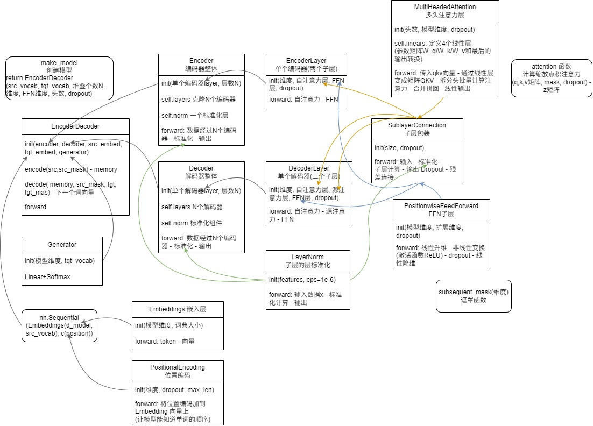

#### 深度学习

- **机器学习 (Machine Learning)**：<u>让机器通过数据自己找规律</u>，而不是人类死记硬背地写代码，都叫机器学习。

  - **怎么做**：用已知的数据与结果的映射关系训练一个数学模型，使得这个模型在遇到新的数据时能够预测出正确的结果（输入和输出可以是各种数据类型）。
  - **用途**：可以处理**图像**（计算机视觉：识别人脸、自动驾驶）、可以处理**数值**（金融预测：预测股票走势、风控评分）、可以处理**声音**（语音识别：把录音转成文字）。
    - **NLP**：专门处理**文本/语言**数据。

  - **深度学习 (Deep Learning)** 是机器学习的一种。特指模仿人脑神经元、层数很多的神经网络。

- **结构**：模仿大脑，建立了很多层“神经元”。每一层都在做特征提取。

  “深” 代表层数多： 现在的深度学习模型（比如 GPT）可能有成百上千层，这种深度让它能理解极其复杂的逻辑。

  > 第一层可能只认得“线条”，第二层认得“形状”，第三层认得“脸”，最后一层认得“这是张三”。

#### Tokenization 和 Embedding

- **Tokenization（Token 化）**：<u>将一段文本拆分成更小的单位（Token），并给每个 Token 一个唯一的编号（ID）</u>。

  > 例如：“我爱吃苹果”
  >
  > “我” → 1号；“爱” → 2号；“吃” → 3号；“苹果” → 4号
  >
  > 结果：“我爱吃苹果” 在机器眼里就变成了 `[1, 2, 3, 4]`
  >
  > 在中文里，一个 Token 可能是一个词（“苹果”），也可能是一个字（“苹”）

- **Embedding（向量化）**：<u>把每个编号（Token ID）转换成一串数字</u>（向量，比如 `[0.12, -0.5, 0.88...]`），让意思相近的词，在数学空间里离得更近。

  > 光有编号是不够的。在机器看来，1号和2号只是数字，它不知道“猫”和“狗”很像，而“猫”和“石头”完全没关系。
  >
  > 假设：“猫”的坐标是 `[1, 1]`；“狗”的坐标是 `[1.1, 0.9]`（离猫很近）
  >
  > “石头”的坐标是 `[-5, 8]`（离猫很远）
  >
  > 这样机器就能通过计算知道：“猫和狗离得更近，它们有共同点都是宠物。”

  - **常见模型**：ChatGPT-Embedding（https://developers.openai.com/api/docs/models/text-embedding-3-small）、ERNIE-Embedding V1（百度文心）、M3E（https://huggingface.co/moka-ai/m3e-base）、BGE（https://huggingface.co/BAAI/bge-base-en-v1.5）


## NLP

**NLP (自然语言处理)** ：专门处理<u>人类文本&语言</u>（翻译、聊天、总结）的任务

> **NLP 任务（业务层）：** 分类、聚类、回归、生成
>
> **核心架构（模型层）：** Transformer（目前最强，取代了 RNN 和 LSTM）
>
> **核心组件（零件层）：** Self-Attention（雷达）、QKV（匹配）、FFN（加工）
>
> **底层原理（数学层）：** 前向传播（预测）、损失函数（评估）、优化器（纠错）
>
> **数据表现（形式层）：** Token化（编号）、Embedding（变向量）

### 解决任务（业务层）

| **机器学习底层任务**      | **做什么**           | **对应的 NLP 任务**                                |
| ------------------------- | -------------------- | -------------------------------------------------- |
| **分类 (Classification)** | 判断类别             | **情感分析**（好评还是差评？）、**垃圾邮件识别**   |
| **回归 (Regression)**     | 输出数值             | **文档相似度评分**（0到1分）、**字数预测**         |
| **聚类 (Clustering)**     | 分组                 | **话题发现**（把新闻自动分成科技类、财经类）       |
| **生成 (Generation)**     | 根据概率创造新的数据 | **机器翻译**、**自动写诗**、**对话系统 (Chatbot)** |

### 核心架构（模型层）

这些都是**处理序列数据机制**（文字就是一种序列）。它们把“一串文字”变成“一串向量”，有了这串向量，接个分类头就是**分类**，接个生成头就是**对话**。

- **==RNN==（Recurrent Neural Network，循环神经网络）**

  - **核心逻辑**：它在处理当前这个词的时候，会把**上一个词处理完后的“记忆”**也拿过来一起算。

    - 输入：当前的词 $x_t$ + 上一时刻的记忆 $h_{t-1}$。

    - 输出：当前的理解 $h_t$。

  - **缺点**：**串行计算**（速度慢） + **梯度消失**（长距离依赖问题）。

    因为它是通过不断的乘法来传递记忆的，如果句子很长，前面的信息在不断的乘法中会迅速变小（趋近于0），模型就断片儿了。

    > 第一句是“张三”，传到第十个人时，可能变成了“大山”。

- **==LSTM==（Long Short-Term Memory，长短期记忆网络）**

  - **核心逻辑**：为了解决 RNN 这种“走一步忘一步”的毛病，科学家给它装了三个**控制开关（门控机制）**，可以把 LSTM 的底层想象成一个**拥有精密开关的储藏室**。
    - **遗忘门 (Forget Gate)：** 决定上一时刻的哪些记忆是没用的，赶紧**扔掉**。（比如：看到新主语了，就把旧主语的性别忘掉）。
    - **输入门 (Input Gate)：** 决定当前的这个新词，有哪些信息值得**存进**储藏室。
    - **输出门 (Output Gate)：** 决定现在储藏室里的这些信息，哪些要**拿出来**作为当前的理解输出。
  - **结果：** 它的记忆力比 RNN 强得多，能处理几百个词的句子。
  - **局限性：** **结构复杂**（计算量巨大） + 依然是**串行**（必须一个一个处理）

- **==Transformer==**

  - **核心逻辑**：全场扫描 + 重点标记。它不再是一个字一个字地读，而是一次性把整句话（甚至整本书）丢进去。

    - **Self-Attention（重点标记）：** 它会给每个词发一个“雷达”。比如读到“苹果”，它会扫描全场，发现“好吃”和“红”跟“苹果”关系最铁，于是把这两个词的信息“重点标记”并拉过来。
    - **匹配加权：** 它不需要 LSTM 那样复杂的开关，它直接用**数学加权**（QKV 匹配）决定谁更重要。

  - **优点**：**并行计算**（速度快） + **Self-Attention** 解决长距离依赖问题 + **QKV** 匹配加权

    > **并行计算**：所有的词可以**同时**进入模型进行计算。充分压榨 GPU 的性能。原本 RNN 需要训练一周的数据，Transformer 可能几个小时就跑完了。

  - **为什么 Transformer 统治了所有任务？**

    以前大家分工很细：

    - RNN/LSTM 以前主要用来做翻译、语音识别（因为它们擅长处理顺序）。

    - Transformer 发现它不仅翻译更强，而且在**分类、生成、理解**所有任务上，全部打破了记录。
      - **分类：** 比如 BERT（基于 Transformer 的 Encoder）。
      - **生成：** 比如 GPT（基于 Transformer 的 Decoder）。

### 用 LLM 实现 NLP

在过去，需要为每个任务训练一个专门的模型（比如一个专门做翻译，一个专门做分类）。但 LLM 的逻辑是“万物皆可生成”。

- **==统一的接口和格式==**：文本进，文本出，Next Token Prediction，即根据上文，预测概率最大的下一个字（Token）是谁。

  - **以前（判别式模型）：** 如果你想做情感分析（分类），你需要设计一个输出为 `0` 或 `1` 的模型；想做翻译，要设计一套复杂的对齐算法。

  - **现在（生成式模型）：** 无论什么任务，我都把它变成**聊天**。LLM 并不需要你改动模型结构，你只需要通过 **Prompt（提示词）** 告诉它你想做什么。

    > **分类任务：** 问：“这句话是好评吗？” 答：“是的”
    >
    > **翻译任务：** 问：“把这句话翻译成英文。” 答：“Hello”
    >
    > **提取任务：** 问：“找出这段话里的人名。” 答：“张三”


## Transformer

**Transformer**：会“看上下文”的模型

| 模块                    | 干什么       |
| ----------------------- | ------------ |
| Embedding（嵌入）       | 把词变成向量 |
| Attention（注意力机制） | 看上下文关系 |
| FFN（前馈网络）         | 做计算       |
| 输出层                  | 生成结果     |

- **==输入== (Input)：**
  1. **Token IDs：** 文字 → Token → 编号
  2. **Embedding（词向量）：** 编号 → 向量
  3. **Positional Encoding（位置编码）：** 给向量加上“位置信息”，因为 Transformer 是一次性看全句的，必须告诉它哪个词在前，哪个词在后。
  
- **==输出== (Output)：**
  
  - **向量序列：** 经过多层 Transformer 处理后，输出的仍然是一串向量。
  - **概率分布：** 把向量映射到概率词表上。比如输出：[“苹果”: 0.8, “香蕉”: 0.1, ...]。
  - **最终结果：** 模型选择概率最高的那个词作为这一次的输出（“苹果”）
  
- **==整体结构==**

  

  

### **Attention（注意力机制）**

> Attention **出现的原因**：基于循环神经网络（RNN）一类的 seq2seq 模型，在处理长文本时遇到了挑战，而对长文本中不同位置的信息进行attention有助于提升RNN的模型效果。

- **==seq2seq 框架==**：一种常见的 NLP 模型结构（sequence to sequence，序列到序列），输入一个序列，输出一个序列。

  > <u>编码器</u>处理输入序列中的每个元素并获得输入信息，并转换成为一个<u>context向量</u>。处理完整个输入序列后，编码器把 context向量发送给<u>解码器</u>，解码器通过context向量中的信息，逐个元素输出新的序列。

- **基于 ==RNN== 的 seq2seq 框架**：

  > <u>编码器</u>处理输入序列中的每个元素（*RNN*）并获得输入信息，并转换成为一个context向量</u>。处理完整个输入序列后，编码器把 context向量发送给<u>解码器</u>，解码器通过context向量中的信息，逐个元素输出（*RNN*）新的序列。

  - **RNN（Recurrent Neural Network，循环神经网络）**：当前的记忆 = 当前词的信息 + 之前的记忆

    - 假设序列输入是一个 n 个词的句子

    - RNN将句子中的每一个词映射成为一个向量 → 得到一个向量序列（word embedding）

    - 处理每个时间步的序列：$h_t = RNN(x_t, h_{t-1})$ 

      当前的记忆 = 当前词的信息 + 之前的记忆

      > | 符号      | 含义             |
      > | --------- | ---------------- |
      > | $x_t$     | 当前这个词的向量 |
      > | $h_{t-1}$ | 上一步记住的信息 |
      > | $h_t$     | 当前新的记忆     |

  - **编码器**：

    ```
    输入: x1, x2, x3, ..., xn → 编码器把每个词变成embedding
    RNN 计算:
    	h1 = RNN(x1, h0)
    	h2 = RNN(x2, h1)
    	...
    	h_n = RNN(xn, h_{n-1})
    输出: context = h_n
    ```

  - **解码器**：

    ```
    输入: 
    	上一个输出词 y_{t-1} 的 embedding
    	上一个 hidden state（h_{t-1}, 第一个h0就是encoder生成的context）
    RNN: h_t = RNN(y_{t-1}, h_{t-1})
    变成词概率: logits = W * h_t + b
    得到每个词的概率: prob = softmax(logits) 
    选词: y_t = argmax(prob)
    ```

  - **存在问题**：基于RNN的seq2seq模型编码器所有信息都编码到了一个context向量中；① 单个向量很难包含所有文本序列的信息，② RNN递归地编码文本序列使得模型在处理长文本时面临非常大的挑战，无法有区分有重点地关注输入序列

- **==带有注意力的 seq2seq 模型==**：

  - 编码器<u>把所有时间步的 hidden state（隐藏层状态）传递给解码器</u>，而不是只传递最后一个 hidden state。
  
  - 解码器在产生输出之前，做了一个额外的attention处理。
  
    > 给每个 hidden state计算出一个分数 
    >
    > → 分数经过 softmax 进行归一化（变成概率分布，即权重）
    >
    > `[2.1, 1.0, 0.5] → softmax → [0.6, 0.3, 0.1]`
    >
    > → 每个 hidden state 乘以所对应的分数，高分放大，低分缩小 
    >
    > → 将所有hidden state 加权求和，得到对应时间步的context向量
    >
    > `context = 0.6*h1 + 0.3*h2 + 0.1*h3`
  
  - attention可以简单理解为 = <u>一种有效的加权求和技术</u>，其艺术在于如何获得权重
  
    | 概念             | 本质                                                         |
    | ---------------- | ------------------------------------------------------------ |
    | **embedding**    | 词查表得到的向量                                             |
    | **hidden state** | RNN 计算出来的 “当前语义状态”                                |
    | **context**      | attention 加权得到的 “输入信息总结”，是用 hidden state 计算出来的 |
  
  - **解码器**：
  
    上一个词 embedding（$y_{t-1}$） + 上一个 hidden state（$h_{t-1}$）
  
    → RNN 计算新的 hidden state（当前状态）：$h_t = RNN(y_{t-1}, h_{t-1})$
  
    → Attention 计算（输入句子重点）：$h_t + 所有 h_i → context \ C_t$
  
    > h_t：decoder 当前状态（“我现在需要什么”）
    >
    > h_i：encoder 各个位置（“输入里有什么”）
    >
    > context 的“数值”来自 encoder 的 h_i 加权求和，但“权重”是由 decoder 的 h_t 决定的
  
    → 拼接两个向量 $[h_t ; C_t]$
  
    → $y_t = softmax(FFN([h_t ; C_t]))$

### 编码器 Encoder


#### **Self-Attention 层**

- **作用**：让模型在处理每一个词时，都能“向左看、向右看”，去发现句子中其他词与它的关联强度。

  > 想象你在读一句话：“那个**苹果**很好吃，**它**又红又甜。
  >
  > ”**没有 Attention：** 模型看每个词都是孤立的。
  >
  > **有了 Attention：** 模型知道“它”的注意力应该大量放在“苹果”上，少量放在“好吃”上。

- **Q、K、V**：实现 Attention 的具体手段

  - **Q (Query - 查询)：** 我想找什么样的。（比如：我是“它”，我要找我指代的对象）。
  - **K (Key - 键值)：** 我手里有什么标签。（比如：“苹果”身上贴着“名词、水果”的标签）。
  - **V (Value - 数值)：** 我真正的内涵。（一旦匹配成功，就把这个词的详细信息传过去）。

  **工作流程：**

  1. 拿我的 **Q** 去跟所有人的 **K** 算一个匹配分（相似度）。
  2. 分数越高，说明关系越近。
  3. 根据分数高低，把大家的 **V** 加权汇总起来，作为我这个位置的新表达。

```
输入 x
→ 变成 q,k,v
→ q 和 k 算相关性 attention score
→ 每个除以 √d_k 保持梯度稳定
→ softmax 变为权重
→ 加权 v
→ 得到输出 z
```

- **分步计算**：


- **矩阵计算**：把所有词向量放到一个矩阵X中，然后分别和3个权重矩阵$W^Q, W^K W^V$ 相乘，得到 Q，K，V 矩阵；然后和 V 相乘。

  $Attention(Q, K, V) = \text{softmax}(\frac{QK^T}{\sqrt{d_k}})V$


#### **多头注意力机制**

- 有多组权重矩阵，这里以八个为例，得到8个输出矩阵 {Z0,Z1...,Z7} 
- 把这八个矩阵拼接起来（因为前馈神经网络层接收的是 1 个矩阵），把拼接后的矩阵和WO权重矩阵相乘（映射到前馈神经网络层所需要的维度），得到最终的矩阵Z。这个Z矩阵包含了所有 attention heads（注意力头） 的信息。这个矩阵会输入到 FFNN (Feed Forward Neural Network）层。

```python
class MultiheadAttention(nn.Module):
    def __init__(self, hid_dim, n_heads, dropout):
        super(MultiheadAttention, self).__init__()
        self.hid_dim = hid_dim   # 每个词输出的向量维度（比如300）
        self.n_heads = n_heads   # 多头注意力的数量（比如6）

        # 保证hid_dim必须能整除h(每个head的维度=hid_dim/n_heads)
        assert hid_dim % n_heads == 0
        # 定义矩阵
        self.w_q = nn.Linear(hid_dim, hid_dim) # 定义 W_q 矩阵
        self.w_k = nn.Linear(hid_dim, hid_dim) # 定义 W_k 矩阵
        self.w_v = nn.Linear(hid_dim, hid_dim) # 定义 W_v 矩阵
        self.fc = nn.Linear(hid_dim, hid_dim) # 把多个head拼接后的结果再变换一次
        self.do = nn.Dropout(dropout) # 避免只依赖少数几个位置
        self.scale = torch.sqrt(torch.FloatTensor([hid_dim // n_heads])) # 缩放:score/√d_k

    def forward(self, query, key, value, mask=None):
        # 1. 线性变换得到 Q K V
        bsz = query.shape[0] # 批大小
        Q = self.w_q(query)
        K = self.w_k(key)
        V = self.w_v(value)
        
        # 2. 拆分多头,维度重塑: 把 K Q V 矩阵拆分为多组注意力
        Q = Q.view(bsz, -1, self.n_heads, self.hid_dim //
                   self.n_heads).permute(0, 2, 1, 3)
        K = K.view(bsz, -1, self.n_heads, self.hid_dim //
                   self.n_heads).permute(0, 2, 1, 3)
        V = V.view(bsz, -1, self.n_heads, self.hid_dim //
                   self.n_heads).permute(0, 2, 1, 3)
        
        # 3. Q 乘以 K的转置，除以√d_k
        attention = torch.matmul(Q, K.permute(0, 1, 3, 2)) / self.scale
        if mask is not None:
            attention = attention.masked_fill(mask == 0, -1e10)
        # 如果 mask 不为空，那么就把 mask 为 0 的位置的 attention 分数设置为 -1e10.
        # 当对一个极小的负数做 Softmax（指数运算）时，结果几乎就是 0. 这一步相当于强行告诉模型：“这几个位置是垃圾信息或者是未来的信息，你给它们的注意力必须是 0

        # 4. 加权汇总
        attention = self.do(torch.softmax(attention, dim=-1)) # 使用softmax变成概率,和为一
        x = torch.matmul(attention, V) # 乘以V

        # 5. 整合结果
        x = x.permute(0, 2, 1, 3).contiguous()
        x = x.view(bsz, -1, self.n_heads * (self.hid_dim // self.n_heads))
        x = self.fc(x)
        return x


# batch_size 为 64，有 12 个词，每个词的 Query 向量是 300 维
query = torch.rand(64, 12, 300)
# batch_size 为 64，有 12 个词，每个词的 Key 向量是 300 维
key = torch.rand(64, 10, 300)
# batch_size 为 64，有 10 个词，每个词的 Value 向量是 300 维
value = torch.rand(64, 10, 300)
attention = MultiheadAttention(hid_dim=300, n_heads=6, dropout=0.1)
output = attention(query, key, value)
## output: torch.Size([64, 12, 300])
print(output.shape)
```

#### FFN

FFN（Feed-Forward Network，前馈神经网络）

- **核心逻辑：** 消化、吸收与特征提取。

  如果说 Self-Attention 是在**“社交”**（收集周围词的信息），那么 FFN 就是在**“闭关修炼”**。 

  在每个 Transformer 块里，做完 Attention 后，信息会进入 FFN。它<u>对每个词的位置进行独立的、复杂的非线性变换</u>。

  把搜集到的社交信息进行“深加工”，提取出更高级的特征。它不关心别的词，只专注于把当前这个位置的信息变得更丰富。

#### 残差连接

编码器的每个子层（Self Attention 层和 FFNN）都有一个残差连接和层标准化（layer-normalization）

- **残差连接**：$$Output = Attention(x) + x$$

  是 “深层加工后的结果” + “最原始的结果”，保证原始信息能直接传到后面。

- **层标准化** (Layer Normalization, LayerNorm)：数据经过矩阵乘法后，数值可能变得忽大忽小。层标准化把这些数值**强行拉回到一个稳定的范围内**（映射到“平均分 0，标准差 1”的区间里），让模型训练得更快更稳。

  ```py
  class EncoderLayer(nn.Module):
      def __init__(self, hid_dim, n_heads, dropout):
          super().__init__()
          self.attention = MultiheadAttention(hid_dim, n_heads, dropout)
          self.norm = nn.LayerNorm(hid_dim) # 层标准化层
          
      def forward(self, x):
          # 1. 先做注意力计算
          attn_out = self.attention(x, x, x)
          # 2. 残差连接 + 层标准化
          # 把原始的 x 和算出来的 attn_out 加起来，再标准化
          x = self.norm(x + attn_out) 
          return x
  ```


### 解码器 Decoder

```
decoder_input
   ↓
Masked Self-Attention
   ↓
x1（这里产生 Q）
   ↓
Encoder-Decoder Attention（Q=x1, K/V=encoder_output）
   ↓
x2
   ↓
FFN
   ↓
x3（输出）
```

- **第1层：Masked Self-Attention**

  ```
  输入：decoder 当前序列（比如已生成的词）
  输出：新的表示（只看左边，不能看未来） x1 = SelfAttention(decoder_input)
  ```

  > 只能 “向后看” 的 **Masked Self-Attention**：不能偷看未来的词。即在计算分数时，把当前位置之后的词全抹成 `-inf`（负无穷）。
  >
  > 这是因为训练时会给出完整的翻译结果，如果不遮住，模型就会直接“抄答案”，而不是根据已有的词去预测下一个词。

- **第2层：Encoder-Decoder Attention（交互注意力层）**

  解码器拿着自己的 $Q$（我想翻译下一个词），去编码器输出的 $K$ 和 $V$ 里找（原文里哪个词跟我现在要吐的词最相关？）。

  > 例子：翻译“I love coding”时，当解码器准备输出“coding”，它通过这个注意力层，会特别关注原文中的“编程”二字。

  ```
  输入:	  Q 来自：x1（decoder自己的）
  	   K,V 来自：encoder输出
  输出:   x2 = Attention(Q=x1, K=encoder_output, V=encoder_output)
  ```

  - **当前时间步的 Q（Query）**：来自于解码器自己已经翻译出来的部分

  - **来自编码器的 K、V**：这是编码器给的“参考资料”

    > 编码器最后一层输出的是一个形状为 `[batch_size, seq_len, hid_dim]` 的张量（比如 `[64, 10, 300]`）。
    >
    > 在**解码器工作**时，它会把这个张量**复制两份**：
    >
    > **第一份作为 K**：用来和解码器当前的意图（$Q$）做对比。例如，解码器想翻译“苹果”这个词，它拿 $Q$ 去和编码器输出的 $K$ 挨个比对，发现原文里第三个词“Apple”最匹配。
    >
    > **第二份作为 V**：一旦确定了哪个词最匹配，就从这里提取信息。例如，既然发现第三个词最匹配，就从 $V$ 的第三个位置把“Apple”的语义信息提取出来。
    >
    > **底层真相**：虽然它们的数据来源一模一样，但它们会分别乘以解码器内部定义的 `self.w_k` 和 `self.w_v` 矩阵。这样在数学上，同一个编码器输出就被投影成了两个不同的表示。

- **第3层：FFN（前馈网络）**

  ```
  x3 = FFN(x2)
  ```

#### 线性层（Linear）和 Softmax

将 Decoder 最终输出的一个向量（每个元素是浮点数）转换为单词

- **线性层（Linear）**：一个普通的全连接神经网络，把解码器输出的向量，映射到一个更大的向量，这个向量称为 logits 向量。假设我们的模型有 10000 个英语单词（模型的输出词汇表），此 logits 向量便会有 10000 个数字，每个数表示一个单词的分数。
- **Softmax 层**：把这些分数转换为概率（把所有的分数转换为正数，并且加起来等于 1）。然后选择最高概率的那个数字对应的词，就是这个时间步的输出单词。
- **怎么根据概率分布选词**？：贪婪解码 vs. 集束搜索
  - **贪婪解码 (Greedy Decoding)**：每一步只选概率最大的那个词
    - **缺点**：短视。第一步选了概率最高的词，可能导致后面整个句子变得很怪，没法回头。

  - **集束搜索 (Beam Search)**：每一步不只选一个，而是保留 **k 个**（比如 2 个或 5 个）表现最好的“候选者”。

    - **过程**：
      1. 第一步：保留 "I" 和 "A"（假设它们概率最高）
      2. 第二步：分别从 "I" 和 "A" 出发，看接什么词后的整句总概率最高
      3. 最后：从多条路径中选出总分最高的一条

    - **优点**：更全局化，翻译质量通常比贪婪解码高

#### 损失函数

- **损失函数（Loss Function）** ：衡量模型给出的概率分布与真实标准答案（Label）之间的**距离**。

  - **交叉熵（Cross-Entropy）**：最常用。它对“明明正确却给低分”的情况惩罚非常重。

- **训练逻辑**：

  1. **前向传播**：模型猜一个概率分布
  2. **计算 Loss**：发现正确词的概率只有 0.1，Loss 很大
  3. **反向传播**：根据 Loss 顺藤摸瓜，去修改模型内部那些 `w_q`, `w_k`, `w_v` 的参数
  4. **目标**：下一次再遇到同样的输入，模型给正确词的概率能从 0.1 变成 0.2，以此类推

- **多步输出：长句子的挑战**

  对于句子 “I am a student”，解码器不是一次性吐出来的，而是**逐个位置对比**：

  - 位置 1：对比模型输出与 "I" 的距离
  - 位置 2：对比模型输出与 "am" 的距离
  - 位置 5：对比模型输出与 `<eos>`（结束符）的距离


## BERT

Bidirectional Encoder Representations from Transformers

- **预训练+微调（finetune）**：首先在大规模无监督语料上进行预训练，然后在预训练好的参数基础上增加一个与任务相关的神经网络层，并在该任务的数据上进行微调

  - **微调**：针对特定任务需要，在BERT模型上<u>增加一个任务相关的神经网络</u>，比如一个简单的分类器，然后在特定任务监督数据上进行微调训练。（微调的一种理解：学习率较小，训练epoch数量较少，对模型整体参数进行轻微调整）

    由于这一层神经网络参数是新添加的，一开始只能随机初始化它的参数，所以需要用对应的监督数据来训练这个classifier。由于classifier是连接在BERT模型之上的，训练的时候也可以更新BERT的参数。

- **结构**：BERT 模型结构基本上就是 <u>Transformer的encoder部分堆叠起来</u>，BERT-base对应的是12层encoder，BERT-large对应的是24层encoder。

  - **普通 Transformer / GPT（单向）：** 读到某个词时，只能看到它前面的词。就像**从左往右**看书。

  - **BERT（双向）：** 读到某个词时，会**同时看到左边和右边**所有的词。

    > **例子：** “我想吃 [MASK] 苹果。”
    >
    > GPT 只能看到“我想吃”，然后猜后面。
    >
    > BERT 能看到“我想吃”和“苹果”，从而更精准地猜出中间是“红色的”或“一个”。

- **输入**：

  - **Token Embedding：** 单词的数字编号（比如“苹果”对应的 ID）
  - **Segment Embedding：** 用来区分这是第一句话还是第二句话
  - **Position Embedding：** 单词的位置信息

  - 输入的开头永远有一个 `[CLS]`（用于分类），句子之间用 `[SEP]` 隔开。使用 token 作为最小的处理单元，而不是使用单词本身。

- **输出**：输入多少词，输出多少词的理解

  - **每个词的向量：** 它会给句子里每个词都输出一个更深刻的向量（包含了上下文信息的 Embedding）。
  - **整句的向量：** `[CLS]` 位置输出的向量，代表了整句话的意思。

  BERT 输入的所有token经过BERT编码后，会在每个位置输出一个大小为hidden_size（在 BERT-base中是 768）的向量。

  对于句子分类的例子，直接使用第1个位置的向量输出（对应的是[CLS]）传入classifier网络，然后进行分类任务。

- **预训练**：因为 BERT 能看到全场，它不能像 GPT 那样预测下一个词（不然它就直接看到答案了）。以往的 NLP 预训练通常是基于语言模型进行的，比如给定语言模型的前3个词，让模型预测第4个词。

  1. **完形填空 (Masked language model)：** 随机遮住一句话里 15% 的词，让 BERT 去猜这些词是什么。
  2. **判断下一句 (Next Sentence Prediction)：** 给它两句话，让它判断这两句话在逻辑上是不是挨着的。

  


