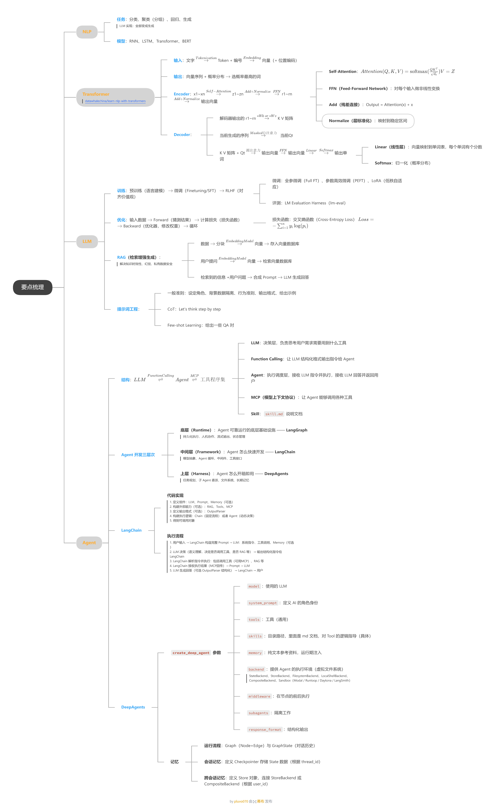

- **NLP**：
  - [NLP 笔记](./Notes_NLP+Transformer.md)

- **Transformer**：
  - [Transformer 笔记](./Notes_NLP+Transformer.md)
  - [Pytorch 编写 Transformer 的代码实现](./Code_Pytorch编写Transformer.md)
  - [Pytorch 编写 Transformer 的代码实现 - 类图](./pytorch_transformer.jpg)

- **LLM**：

  - [LLM 笔记](./Notes_LLM+Agent.md)

- **Agent**：

  - [Agent 笔记](./Notes_LLM+Agent.md)
  - [LangChain 代码写法](./Notes_Langchain.md)
  - [DeepAgents 代码写法](./Notes_DeepAgents.md)
  - [DeepAgents 常用 Tools](./Notes_DeepAgents_Tools.md)
  - [DeepAgents 运行逻辑图](./deepagents_memory.png)

- **整体梳理**：

  - [要点梳理 PDF](./要点梳理.pdf)

  - [要点梳理 思维导图](./要点梳理.png)

    

